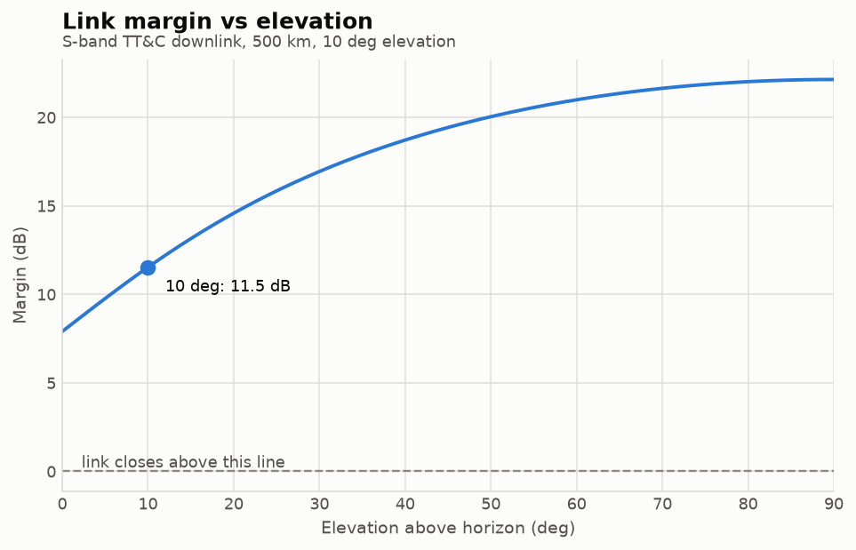

# leo-link-budget

## What it is

## Example result

Link margin for a 1 W, 2 Mbit/s S-band TT&C downlink from a 500 km orbit to a 3 m
ground station, swept from the horizon to zenith: margin rises steeply through the
first few degrees of elevation, where a degree buys a large reduction in slant
range, and flattens toward zenith, where it buys almost none.

## How to run

## Method

## Assumptions

## Validation

## Roadmap

## References
